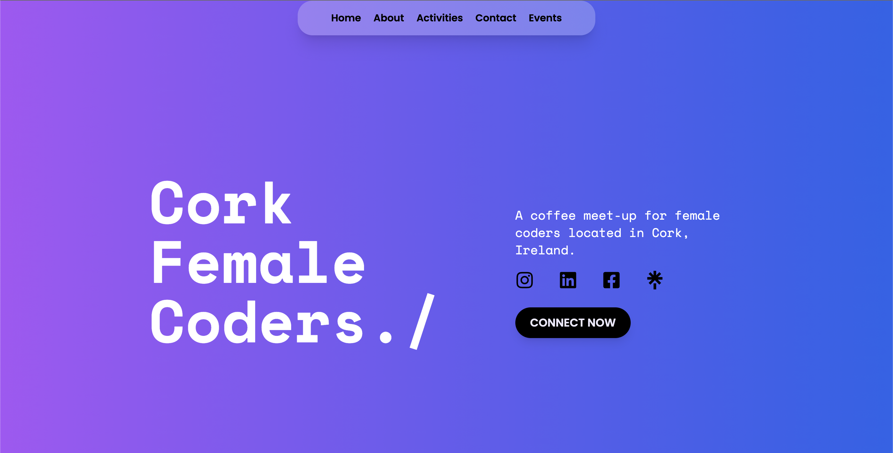
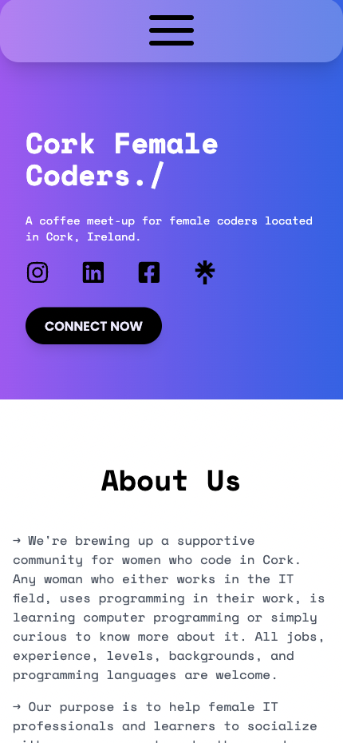

# Cork Female Coders Community Website

The Cork Female Coders community is dedicated to fostering an environment where women in the coding industry in Cork, Ireland, can come together to collaborate, learn, and empower one another. Our website serves as a central hub for community engagement, providing information on upcoming meet-ups, valuable IT-related talks, and resources to support women coders at all stages of their careers.

Please wait for our incoming live version of the fully responsive website to connect and grow with us.

## Getting Started

First, run the development server:

```bash
npm run dev
# or
yarn dev
# or
pnpm dev
# or
bun dev
```

Open [http://localhost:3000](http://localhost:3000) with your browser to see the result.

## Screenshots

Here's how our community platform looks on different devices:

### Desktop Version



### Mobile Version



## Built with

- Next.js 14 App Router
- React Native
- Typescript
- Tailwind
- Formspree

## Get Involved

We welcome all female coders looking to strengthen their skills and connect with like-minded individuals. If you are passionate about coding and wish to be part of an inspiring community, check out our [activities](https://stellawang.netlify.app/#activities) and [join us](https://stellawang.netlify.app/#contact) at our next event!

## Support

If you wish to support the Cork Female Coders community or have any inquiries, please contact us via [email](mailto:corkfemalecoders@gmail.com).

Thank you for being a part of our journey towards a more inclusive and empowered future in tech!
